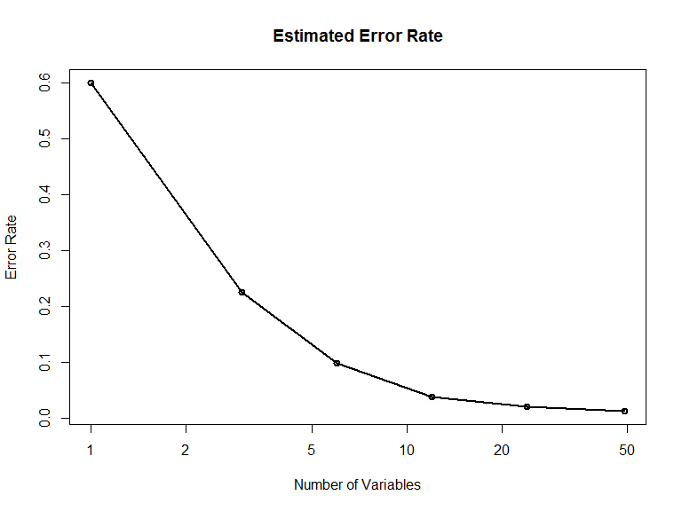

# Predicting Correct Exercise Form
Bryan Wheeler  
Thursday, October 23, 2014  

###Introduction

Human activity recognition is an area of increasing interest for many people that want to monitor their daily activities.  Monitoring behavior patterns with human activity recognition devices such as the Jawbone UP, Nike FuelBan, and Fitbit are helping people closely monitor their exercise routines while improving their health.  

###Data

Data was taken from accelerometers placed on the belt, forearm, arm, and dumbbell of six different people.  Each participant was asked to perform barbell lifts with the attached accelerometers.  Barbell lifts were preformed by each participant using correct form for the exercise, then each participant also performed the barbell lifts using five specifically different types of incorrect form that are common errors when preforming the barbell lift.  In all the barbell lifts were preformed 6 different ways by each participant and a data set was compiled from the readings taken from the attached accelerometers.  Each form of the barbell lift that was preformed was labeled as A,B,C,D,E depending on the way the barbell lift was preformed.  Data sets and further information can be attained at http://groupware.les.inf.puc-rio.br/har#ixzz3H2DPDMtO

###References

Data for this analysis was provided by Ugulino, W.; Cardador, D.; Vega, K.; Velloso, E.; Milidiu, R.; Fuks, H. Wearable Computing: Accelerometers' Data Classification of Body Postures and Movements. Proceedings of 21st Brazilian Symposium on Artificial Intelligence. Advances in Artificial Intelligence - SBIA 2012. In: Lecture Notes in Computer Science. , pp. 52-61. Curitiba, PR: Springer Berlin / Heidelberg, 2012. ISBN 978-3-642-34458-9. DOI: 10.1007/978-3-642-34459-6_6. 

### Cleaning Data and Study Design

In this analysis I attempt to use data generated from a human activity recognition device to quantify how well an individual preforms a barbell lift.  Using a random forest design I hope to produce a model that will correctly predict the form of barbell lift being preformed as A,B,C, or D described in the data section of this analysis.  Our goal is to produce a model that has a maximum out of sample error rate of 3%.

Data was loaded into R from the home directory with the following code.

```r
pml.training <- read.csv("pml-training.csv")    #load training data

pml.testing <- read.csv("pml-testing.csv")      #load testing data
```
Many missing values were located in the pml.training and pml.testing data sets.  Of the 160 variables in both data sets 67 variables contained 19,216 missing values in each data set.  All variables containing  missing values were removed from both data sets along with the first seven variables in both data sets.  After cleaning both pml.testing and pml.training we are left with the cleantest and cleantrain data sets for use in our analysis.  All subsetting of the original data was done with the following code.

```r
#sum missing values in each column
miss <- sapply(pml.training, function(x) sum(is.na(x)))

#index columns with missing values = 19216
deleIndex <- which(miss == 19216)

#subset pml.training and remove columns with missing values
cleantrain <- pml.training[-c(deleIndex)]

#index of factor variables to be removed from data 
deleIndex <- which(lapply(cleantrain,class) == "factor")

#remove response variable classe from index
deleIndex <- deleIndex[-c(37)]

#remove factor variables from data
cleantrain <- cleantrain[-c(deleIndex)]

#remove first 7 columns from data
cleantrain <- cleantrain[-c(1:7)]

#index of columns in both pml.testing and cleantrain data sets
deleIndex <- which(!(colnames(pml.testing) %in% colnames(cleantrain)))

#remove columns not in both pml.testing and cleantrain data sets.
cleantest <- pml.testing[-c(deleIndex)]
```
In the analysis the cleantrain data set will be split into the train and validation data sets. Train data set will consist of 70% of the observations from cleantrain and will be used to train the random forest model.  Validation data set will consist of the remaining 30% of observations from the cleantrain data set and will be used to validate our model and estimate out of sample error once we have finished training the model.  Cleantest data set will be used for testing the finished model.  Below the data is partitioned as described.

```r
library(caret)                  #used for pre processing data
library(randomForest)           #used for random forest model and cross validation  of model
set.seed(123321)                #for reproducibility of results

#partition of data for training and validation of model
inTrain <- createDataPartition(y=cleantrain$classe , p=0.7, list=FALSE)

#training data set
train <- cleantrain[inTrain,]

#validation data set
validation <- cleantrain[-inTrain,]
```

### Cross Validation

Cross validation is accomplished by using the `rfcv()` function from the randomForest package.  In the cross validation process a random forest model is generated from all 49 predictors in the train data set and the predictors are ordered by Gini importance and an error rate is estimated for the model.  Next a new model is generated with the predictors that are in the top 50% in the Gini importance rank and a new model with 24 predictors is generated along with the corresponding error rate for that model. Repeating this process a new model is generated with 12, 6, 3, and 1 predictor and error rates for each model are calculated.

```r
#cross validation function
crossval <- rfcv(train[,-50],train[,50])
```
Using the results from the `rfcv()` function above we can plot the cross validation error rate by the number of predictors used in the model.  As seen in the plot below, the error rate drops significantly as the model predictors increase from 1 to 10.  As the predictors are increased  from 10 to 49 the error rate starts to level off.

```r
#plot of error rate by number of variables used in model
with(crossval, plot(n.var, error.cv, log="x", type="o", lwd=2,
                    xlab="Number of Variables", ylab="Error Rate"))
#title for plot
title(main="Estimated Error Rate")
```

 

Seen below is an exact error rate for the corresponding number of predictors in the model.  We can achieve the lowest error rate by using all the predictors in our model as shown by the 1.259% error rate using 49 predictors.  Since we want a model with the least number of predictors that still meets our requirements of an error rate of approximately 3% we will select a model that uses the 24 most important predictors.  By using 24 predictors our in sample error is estimated to be 1.98% which is an under estimate of our out of same error rate.  Since our target error rate is approximately 3% 24 predictors is a good choice for our random forest model.

```r
#error rate of various models by number of predictors
crossval$error.cv
```

```
##      49      24      12       6       3       1 
## 0.01259 0.01980 0.03822 0.09864 0.22472 0.59999
```
Next we fit a random forest model with all 49 predictors to determine the 24 most important predictors to use in our final model.

```r
#model fit with all predictors
modelFit49 <- randomForest(classe ~., data=train)
```
Listed below are 24 most important predictors listed by their Gini importance.   

```r
#predictors with Gini importance value
import <- importance(modelFit49, sort = TRUE)

#reordering of predictors by importance
import <- import[order(import, decreasing=TRUE),,drop = FALSE]

#24 predictors listed by Gini importance
import[1:24,,drop = FALSE]
```

```
##                      MeanDecreaseGini
## magnet_dumbbell_z               610.6
## pitch_forearm                   588.6
## magnet_dumbbell_y               514.0
## roll_forearm                    493.8
## magnet_dumbbell_x               389.3
## accel_belt_z                    377.3
## magnet_belt_z                   363.6
## magnet_belt_y                   348.9
## roll_dumbbell                   332.1
## accel_dumbbell_y                327.5
## gyros_belt_z                    294.8
## roll_arm                        289.3
## accel_forearm_x                 266.7
## accel_dumbbell_z                263.8
## magnet_forearm_z                245.3
## total_accel_dumbbell            229.0
## magnet_belt_x                   218.9
## total_accel_belt                210.7
## yaw_dumbbell                    210.4
## accel_arm_x                     205.3
## magnet_arm_x                    203.9
## gyros_dumbbell_y                202.9
## magnet_forearm_y                202.7
## accel_forearm_z                 202.2
```

### Final Model

A subset of the train data set is taken with the 24 predictors of highest importance.  A new model is fit with the 24 most important predictors.

```r
#subset of 24 most important predictors
cleantrain24 <- train[,rownames(import)[1:24]]

#random forest model fit with 24 most important predictors
modelFit24 <- randomForest(train$classe ~., data=cleantrain24)
```
Once our model has been fit with the 24 most important predictors we can test the model with the validation data set.  First we use the modelFit24 data to predict outcomes, with the predict() funtion, in the validation data set and compare those predictions to the true outcomes in the data set.  As you can see below the accuracy of our model is 98.7% which gives us an error rate of 1.3% which meets the standard required for our out of sample error rate of 3%.

```r
pred <- predict(modelFit24,validation)

confusionMatrix(pred,validation$classe)
```

```
## Confusion Matrix and Statistics
## 
##           Reference
## Prediction    A    B    C    D    E
##          A 1672    9    0    0    0
##          B    1 1121   17    0    0
##          C    0    9 1006   32    0
##          D    1    0    3  931    4
##          E    0    0    0    1 1078
## 
## Overall Statistics
##                                        
##                Accuracy : 0.987        
##                  95% CI : (0.984, 0.99)
##     No Information Rate : 0.284        
##     P-Value [Acc > NIR] : <2e-16       
##                                        
##                   Kappa : 0.983        
##  Mcnemar's Test P-Value : NA           
## 
## Statistics by Class:
## 
##                      Class: A Class: B Class: C Class: D Class: E
## Sensitivity             0.999    0.984    0.981    0.966    0.996
## Specificity             0.998    0.996    0.992    0.998    1.000
## Pos Pred Value          0.995    0.984    0.961    0.991    0.999
## Neg Pred Value          1.000    0.996    0.996    0.993    0.999
## Prevalence              0.284    0.194    0.174    0.164    0.184
## Detection Rate          0.284    0.190    0.171    0.158    0.183
## Detection Prevalence    0.286    0.194    0.178    0.160    0.183
## Balanced Accuracy       0.998    0.990    0.986    0.982    0.998
```
### Conclusion

We succeeded in producing a random forest model that predicted the form of the dumbbell lift being preformed by a participant. Our approximate outside sample error of 1.3% was below the rate of 3% we were wanting in the model generated.  Our next step would be to use the cleantrain data set to test our model but the results will not be included in this analysis.  

By implementing this model, and similar models with different types of human activity recognition devices consumers will not only be able to track their activities but will also be provided feedback on how well they are preforming certain activities.
